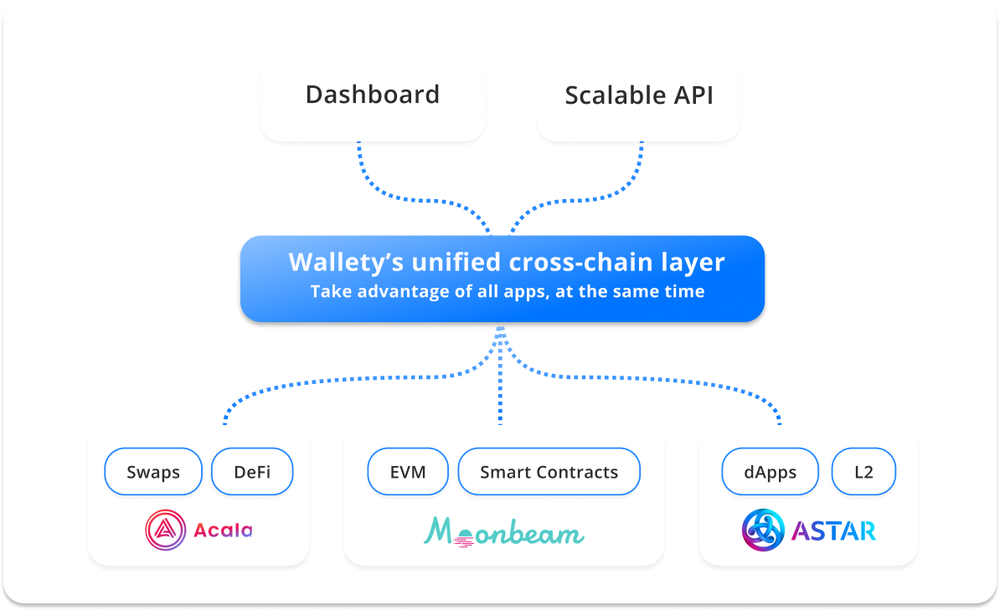

# Intro to Wallety

We will connect multiple chains and protocols to allow users to interact with multiple cross chain economies within one UI/API.

By unifying dApps we can create a first point of contact for users and builders to interact with multiple blockchains seamlessly

<figure><figcaption>
Wallety overview
</figcaption></figure>
